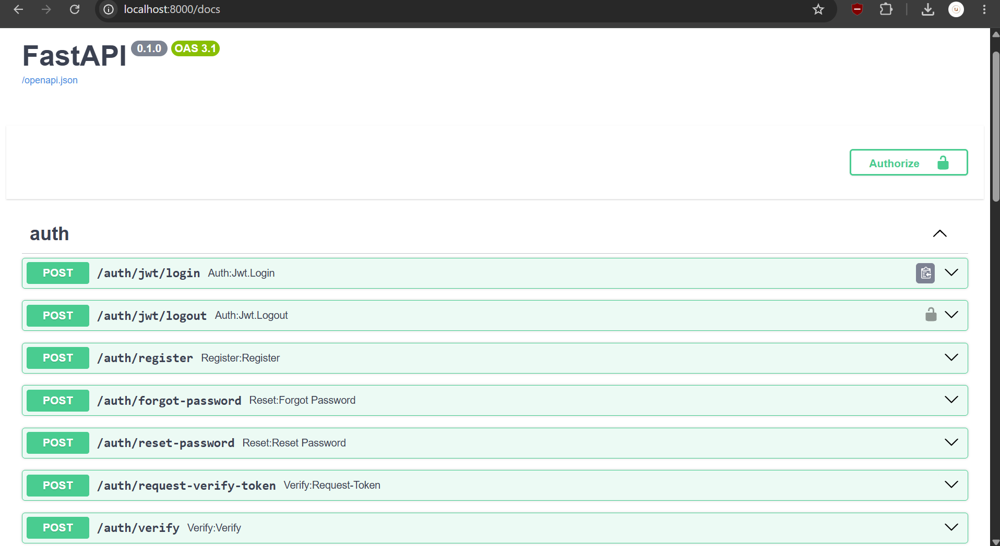
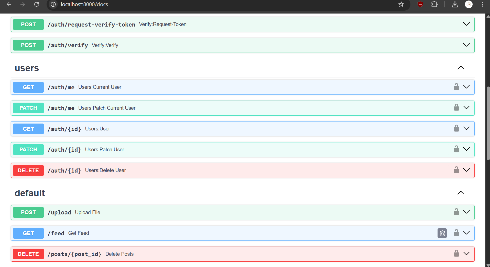
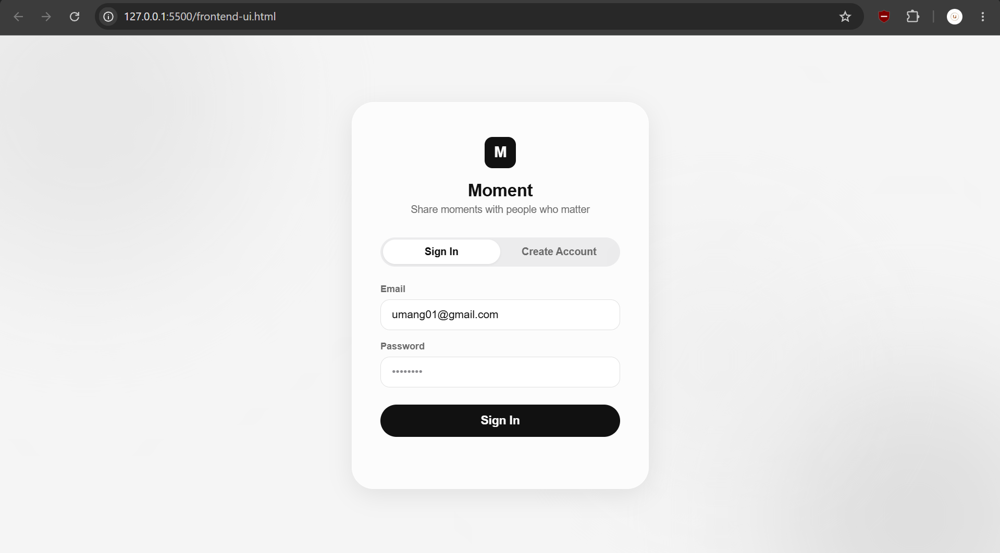
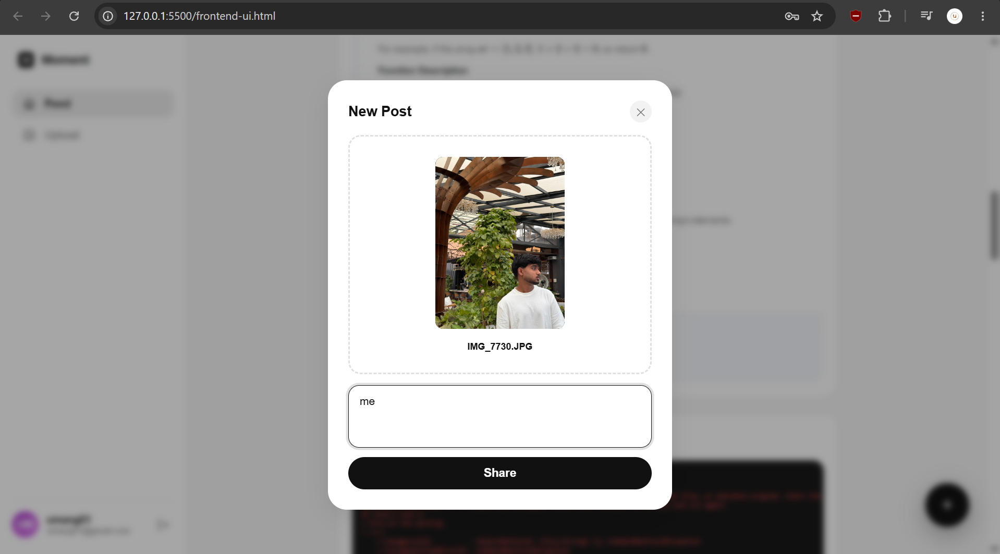
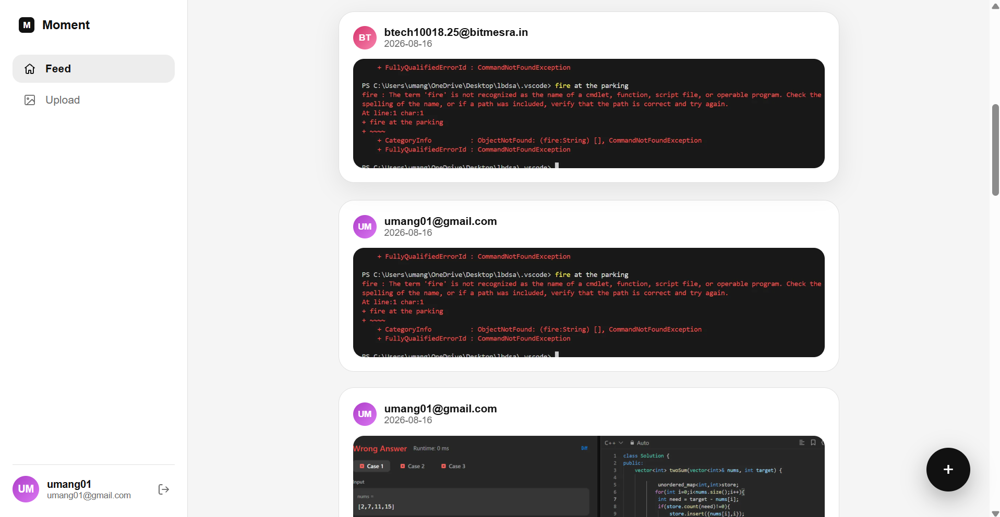
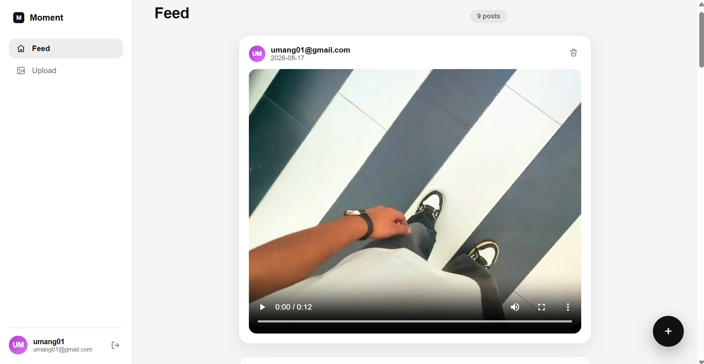
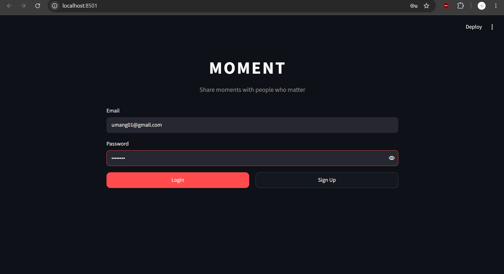
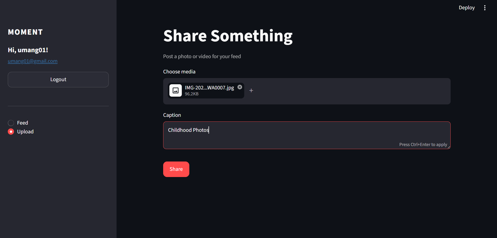
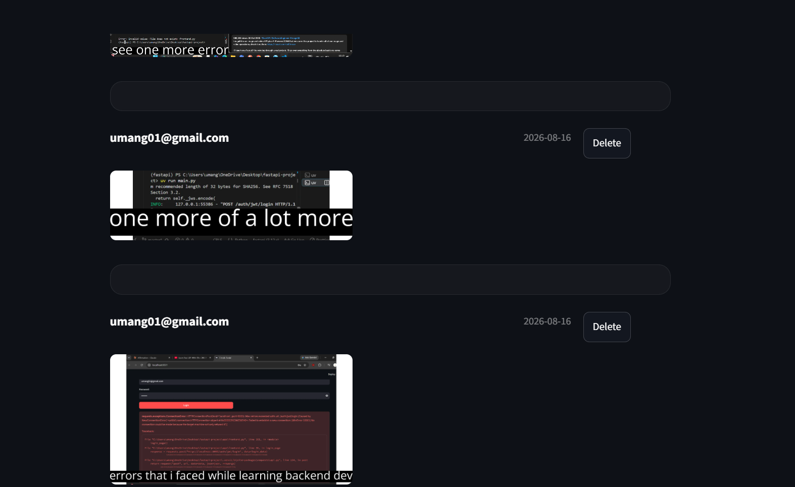
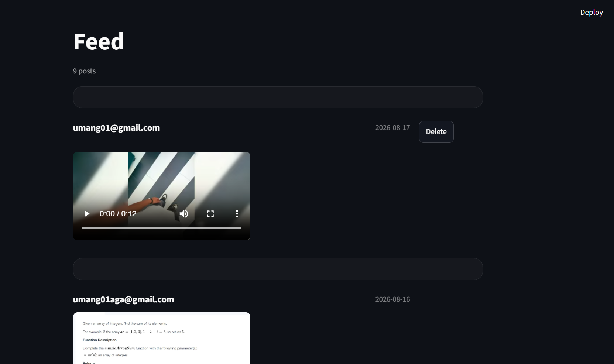

<div align="center">

# 📸 Moment

**What started as a project to learn backend development properly ended up
becoming a small full-stack app, built backend-first, with two different
frontends layered on top to see the API actually come to life.**


</div>

## 🧭 Why this project exists

Most tutorials get you to a working app without making you understand *why*
any of it works. I wanted the opposite: a project focused on backend
fundamentals like authentication, database relationships, file handling, and
the errors that only show up once you actually try to connect two separate
frontends to your own API.

The backend came first, and that's where almost all the real learning
happened. The frontends came after, mostly out of curiosity, to actually see
the API do something and to see how far a good UI could push a small backend
project's presentation without changing a single line of the engineering
underneath it. What began as a backend exercise ended up, almost by accident,
as a small full-stack app.

## ✨ What it does

- Sign up and log in with **JWT-based authentication**
- Upload a **photo or video with a caption**
- Browse a **feed** of everyone's posts, newest first
- **Delete your own posts** (and only your own, enforced server-side)
- View it through **two completely different frontends**, both hitting the same API

## 🛠️ Tech Stack

| Layer          | Tools                                                        |
|-----------------|---------------------------------------------------------------|
| **Backend**     | FastAPI, SQLAlchemy (async ORM), SQLite                       |
| **Auth**        | fastapi-users, JWT tokens, password hashing                    |
| **Media**       | ImageKit (storage + on-the-fly transformations)                |
| **Frontend #1** | Streamlit, built to test the API quickly                      |
| **Frontend #2** | Vanilla HTML / CSS / JS, a minimal custom UI                  |
| **Tooling**     | uv (dependency management & running)                           |

## 📁 Project Structure

```
fastapi-project/
├── app/
│   ├── app.py          # FastAPI app, routes, CORS, router registration
│   ├── db.py            # Database models, session setup
│   ├── schemas.py        # Pydantic request/response schemas
│   ├── users.py          # Auth setup, JWT strategy, user manager
│   ├── images.py          # ImageKit client setup
│   └── frontend.py       # Streamlit frontend
├── frontend-ui.html      # Standalone HTML/CSS/JS frontend
├── main.py               # App entry point
├── pyproject.toml        # Project dependencies
└── .gitignore
```

## 🚀 Running it locally

**1. Clone the repo**
```bash
git clone https://github.com/umang-agarwal-dev/Moment-Project.git
cd Moment-Project
```

**2. Install dependencies**
```bash
uv sync
```

**3. Set up environment variables.** Create a `.env` file in the project root:
```env
SECRET=your_random_secret_key
IMAGEKIT_PRIVATE_KEY=your_imagekit_private_key
IMAGEKIT_PUBLIC_KEY=your_imagekit_public_key
IMAGEKIT_URL=your_imagekit_url_endpoint
```
Get your ImageKit keys from the [ImageKit dashboard](https://imagekit.io/dashboard).

**4. Run the backend**
```bash
uv run main.py
```
Live at `http://localhost:8000`, visit `/docs` for interactive API docs.

**5. Run a frontend**

Streamlit:
```bash
uv run streamlit run app/frontend.py
```

Or just open `frontend-ui.html` directly in your browser (CORS is already
configured on the backend to allow this).

## 📡 API Reference

| Method | Endpoint            | What it does                          |
|--------|-----------------------|-----------------------------------------|
| POST   | `/auth/register`      | Create a new account                     |
| POST   | `/auth/jwt/login`     | Log in, returns a JWT access token       |
| GET    | `/auth/me`             | Get the current logged-in user           |
| POST   | `/upload`               | Upload a photo/video with a caption      |
| GET    | `/feed`                 | Get all posts, newest first              |
| DELETE | `/posts/{post_id}`       | Delete a post, owner only               |

<p align="center">
  
  
</p>

*Interactive docs auto-generated by FastAPI, available at `/docs`.*

## 🧠 What I actually learned

This is the part that mattered most, so I want to actually spell it out rather
than just say "learned a lot":

- **Authentication is more than a login form.** Understanding how a JWT token
  gets issued, verified, and used to protect a route end to end, not just
  hooking up a library, but knowing what it's actually doing.
- **Your ORM models and your real database schema have to agree.** Spent a
  genuinely frustrating stretch debugging a foreign key error that came down
  to exactly this: a mismatch between what SQLAlchemy expected and what the
  database file on disk actually had.
- **File uploads need real cleanup.** Temp files, `try/except/finally`, closing
  file handles, the difference between code that works once and code that
  doesn't leave garbage behind after 100 uploads.
- **CORS stopped being an abstract word.** The moment I built a second frontend
  and my requests got silently blocked, it finally clicked what CORS is
  actually protecting against, and why it's not optional once frontend and
  backend live separately.
- **Debugging is most of the actual skill.** A huge share of this project was
  chasing down a missing comma, a wrong indentation level, or a mismatched
  keyword argument, and getting faster at reading a traceback and knowing
  exactly where to look mattered more than any single feature I added.
- **A backend-first project can still end up full-stack, almost by accident.**
  Once the API was solid, layering a frontend on top, first Streamlit, then a
  custom UI, turned this from a backend exercise into something that actually
  felt like a finished app, without changing a single line of what's really
  doing the work underneath.

## 📸 Screenshots

### Frontend #2: Custom HTML / CSS / JS UI

<p align="center">
  
  
</p>
<p align="center">
  
  
</p>

### Frontend #1: Streamlit UI

<p align="center">
  
  
</p>
<p align="center">
  
  
</p>

## 📄 License

Open source, built for learning, feel free to explore the code.